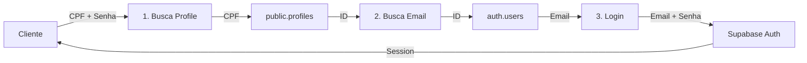

# 🔐 Login com CPF + Senha

## Endpoint
```
POST /api/auth/login-cpf
```

## Descrição
Permite login usando **CPF + senha** em vez de email + senha.

## Fluxo de Autenticação



### Passo a Passo

1. **Recebe CPF + senha** do cliente
2. **Busca em `public.profiles`** pelo CPF para obter o `id` (que é FK de `auth.users.id`)
3. **Busca em `auth.users`** usando `getUserById(id)` para obter o `email`
4. **Faz login** com `signInWithPassword(email, password)` - Supabase valida a senha

## Request

### Body (JSON)
```json
{
  "cpf": "123.456.789-10",
  "password": "senhaForte123"
}
```

### Headers
```
Content-Type: application/json
```

## Response

### ✅ Sucesso (200)
```json
{
  "success": true,
  "message": "Login realizado com sucesso",
  "data": {
    "user": {
      "id": "uuid-do-usuario",
      "email": "usuario@example.com",
      "user_metadata": {
        "full_name": "Nome Completo",
        "cpf": "12345678910"
      },
      "created_at": "2025-01-01T00:00:00Z"
    },
    "session": {
      "access_token": "eyJhbGciOiJIUzI1NiIsInR5cCI6IkpXVCJ9...",
      "refresh_token": "refresh_token_aqui",
      "expires_in": 3600,
      "token_type": "bearer"
    }
  }
}
```

### ❌ Erro: CPF ou senha inválidos (401)
```json
{
  "success": false,
  "error": "CPF ou senha inválidos",
  "message": "Invalid login credentials"
}
```

### ⚠️ Erro: Campos obrigatórios (400)
```json
{
  "success": false,
  "error": "CPF e senha são obrigatórios"
}
```

### ⚠️ Erro: CPF inválido (400)
```json
{
  "success": false,
  "error": "CPF deve conter 11 dígitos"
}
```

### 🚫 Erro: Rate limit (429)
```json
{
  "success": false,
  "error": "Too many requests, please try again later."
}
```

## Rate Limiting

- **Limite:** 5 tentativas a cada 15 minutos
- **Aplicado por:** IP do cliente
- **Compartilhado com:** `/auth/login` (ambos usam `loginLimiter`)

## Validações

### CPF
- ✅ Obrigatório
- ✅ Deve ter 11 dígitos (após limpeza)
- ✅ Aceita formatação: `123.456.789-10` ou `12345678910`

### Senha
- ✅ Obrigatória
- ✅ Validação de força feita pelo Supabase Auth

## Segurança

### 🔒 Proteções Implementadas

1. **Rate Limiting:** Previne brute force (5 tentativas/15min)
2. **Mensagens genéricas:** "CPF ou senha inválidos" (não revela se CPF existe)
3. **Logs detalhados:** Servidor registra tentativas para auditoria
4. **LGPD:** Não expõe dados sensíveis nas respostas de erro
5. **CPF limpo:** Remove formatação antes de buscar no banco

### 🛡️ O que NÃO é exposto
- ❌ Se o CPF existe no banco
- ❌ Se o erro é de CPF ou senha
- ❌ Detalhes internos de erro
- ❌ Estrutura do banco de dados

## Exemplo de Uso

### JavaScript (Fetch)
```javascript
async function loginComCPF(cpf, password) {
  const response = await fetch('https://samm.host/api/auth/login-cpf', {
    method: 'POST',
    headers: {
      'Content-Type': 'application/json'
    },
    body: JSON.stringify({ cpf, password })
  });

  const data = await response.json();
  
  if (data.success) {
    // Salvar token
    localStorage.setItem('access_token', data.data.session.access_token);
    localStorage.setItem('refresh_token', data.data.session.refresh_token);
    
    console.log('Login realizado!', data.data.user);
    return data;
  } else {
    console.error('Erro no login:', data.error);
    throw new Error(data.error);
  }
}

// Uso
loginComCPF('123.456.789-10', 'senhaForte123')
  .then(data => console.log('Usuário logado:', data.data.user))
  .catch(error => console.error('Falha no login:', error));
```

### cURL
```bash
curl -X POST https://samm.host/api/auth/login-cpf \
  -H "Content-Type: application/json" \
  -d '{
    "cpf": "123.456.789-10",
    "password": "senhaForte123"
  }'
```

## Diferenças: `/login` vs `/login-cpf`

| Aspecto | `/auth/login` | `/auth/login-cpf` |
|---------|---------------|-------------------|
| **Identificador** | Email | CPF |
| **Fluxo** | Direto para Supabase Auth | Profile → Auth → Login |
| **Queries** | 1 (signInWithPassword) | 3 (profiles → getUserById → signInWithPassword) |
| **Performance** | Mais rápido | Levemente mais lento |
| **Uso** | Usuários com email | Usuários com CPF |

## Logs do Servidor

### Sucesso
```
🔐 Tentativa de login com CPF: { cpf: 'presente', password: '***', bodyKeys: [ 'cpf', 'password' ] }
🧹 CPF limpo: 12345678910
🔍 Buscando profile pelo CPF em public.profiles...
📊 Resultado da busca profile: { found: true, id: 'uuid-do-usuario' }
👤 Buscando email em auth.users pelo ID: uuid-do-usuario
📧 Email encontrado: usuario@example.com
🔑 Tentando autenticação com email e senha...
✅ Login com CPF realizado com sucesso
```

### Falha (CPF não encontrado)
```
🔐 Tentativa de login com CPF: { cpf: 'presente', password: '***', bodyKeys: [ 'cpf', 'password' ] }
🧹 CPF limpo: 99999999999
🔍 Buscando profile pelo CPF em public.profiles...
📊 Resultado da busca profile: { found: false, id: undefined }
❌ CPF não encontrado no banco
```

### Falha (senha incorreta)
```
🔐 Tentativa de login com CPF: { cpf: 'presente', password: '***', bodyKeys: [ 'cpf', 'password' ] }
🧹 CPF limpo: 12345678910
🔍 Buscando profile pelo CPF em public.profiles...
📊 Resultado da busca profile: { found: true, id: 'uuid-do-usuario' }
👤 Buscando email em auth.users pelo ID: uuid-do-usuario
📧 Email encontrado: usuario@example.com
🔑 Tentando autenticação com email e senha...
❌ Erro na autenticação: Invalid login credentials
Erro ao fazer login com CPF: Error: Invalid login credentials
```

## Database Schema

### Relacionamento das Tabelas
```sql
-- 1. auth.users (Supabase gerenciado)
CREATE TABLE auth.users (
  id UUID PRIMARY KEY,
  email VARCHAR(255) UNIQUE NOT NULL,
  encrypted_password VARCHAR NOT NULL,  -- ← SENHA AQUI
  -- ... outros campos
);

-- 2. public.profiles (Custom)
CREATE TABLE public.profiles (
  id UUID PRIMARY KEY REFERENCES auth.users(id) ON DELETE CASCADE,
  cpf VARCHAR(14) UNIQUE NOT NULL,  -- ← CPF AQUI
  full_name VARCHAR(255) NOT NULL,
  -- ... outros campos
);
```

### Query Flow
```
Cliente envia: CPF + Senha
    ↓
1. SELECT id FROM public.profiles WHERE cpf = '12345678910'
   → Retorna: id = 'uuid-123'
    ↓
2. supabaseAdmin.auth.admin.getUserById('uuid-123')
   → Retorna: { email: 'usuario@example.com' }
    ↓
3. supabase.auth.signInWithPassword({ email: 'usuario@example.com', password: 'senha' })
   → Supabase valida a senha em auth.users.encrypted_password
   → Retorna: { user, session }
```

## Troubleshooting

### Problema: "CPF ou senha inválidos" mesmo com dados corretos

**Possíveis causas:**
1. CPF não está cadastrado em `public.profiles`
2. Senha está incorreta em `auth.users`
3. Usuário foi deletado de `auth.users` mas profile ainda existe (inconsistência)

**Como debugar:**
```sql
-- 1. Verificar se CPF existe
SELECT id, cpf, full_name FROM public.profiles WHERE cpf = '12345678910';

-- 2. Verificar se usuário existe em auth.users
SELECT id, email FROM auth.users WHERE id = 'uuid-do-profile';

-- 3. Verificar relacionamento
SELECT 
  p.cpf, 
  p.full_name, 
  u.email 
FROM public.profiles p
LEFT JOIN auth.users u ON p.id = u.id
WHERE p.cpf = '12345678910';
```

### Problema: Rate limit atingido muito rápido

**Solução:** Aguarde 15 minutos ou ajuste o rate limiter em `src/middlewares/rateLimiter.js`:

```javascript
export const loginLimiter = rateLimit({
    windowMs: 15 * 60 * 1000, // 15 minutos
    max: 5, // ← Aumente este valor se necessário
    // ...
});
```

## Próximas Melhorias

- [ ] Cache de CPF → ID para reduzir queries
- [ ] Suporte a login com CPF ou Email no mesmo endpoint
- [ ] Implementar CAPTCHA após 3 tentativas falhas
- [ ] Adicionar 2FA opcional
- [ ] Webhooks para tentativas de login suspeitas

---

**Documentação atualizada:** 20/10/2025  
**Versão da API:** 1.0.0  
**Commit:** 69a5059
